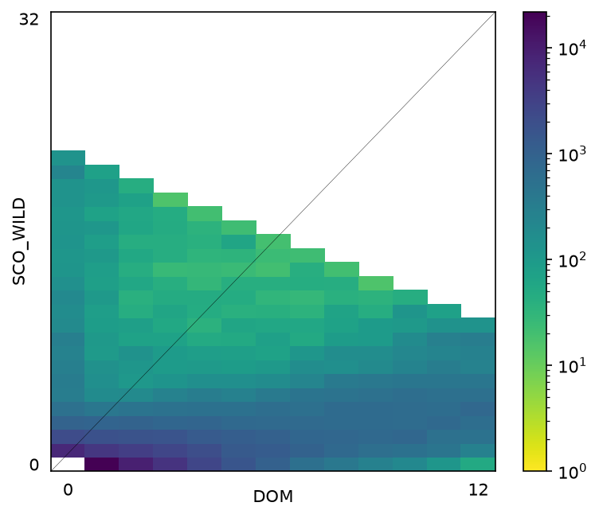
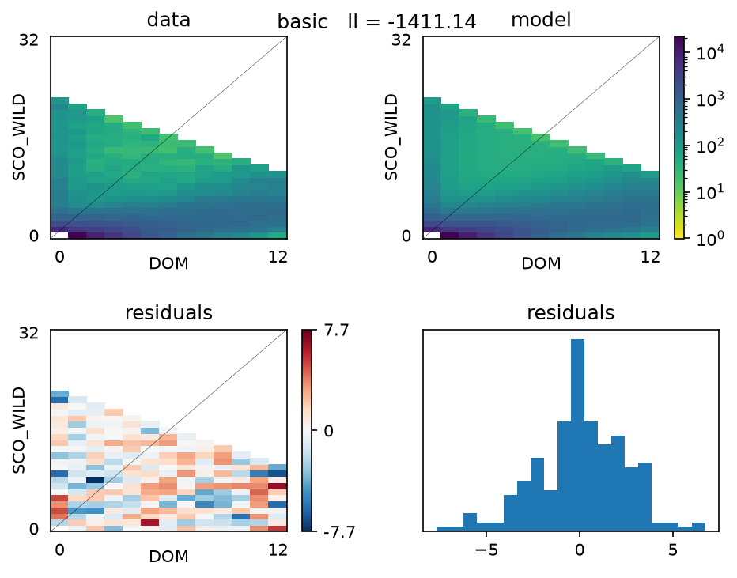

# Scottish wildcat / domestic cat demography

## Introduction

Scottish wildcats (*Felis silvestris*) have hybridised extensively with domestic
cats (*F. catus*). The hybridisation is severe enough that the wild population is
at risk of being genetically swamped: enough domestic ancestry enters the
population each generation that the wildcat genome is progressively replaced
rather than the two forms remaining distinct. Interpreting how far that has gone
needs a demographic baseline. When did the two lineages separate, how much gene
flow has passed between them since, and how large were the populations before and
after the recent collapse of the Scottish one?

This project estimates that baseline by fitting two-population demographic models
to the joint site frequency spectrum (JSFS) with
[dadi](https://dadi.readthedocs.io) 2.4.4, comparing the models with CLAIC, and
putting confidence intervals on the fitted parameters with the Godambe
information matrix.

dadi takes a different route to the same question as the ABC and simulation-based
approaches used elsewhere on this dataset. Rather than simulating replicate
datasets and comparing summary statistics, it numerically solves a
[diffusion approximation](https://journals.plos.org/plosgenetics/article?id=10.1371/journal.pgen.1000695)
to the Wright-Fisher process to get the expected JSFS under a set of demographic
parameters, and scores that expectation against the observed spectrum with a
Poisson likelihood over bins. It is fast, and it returns a likelihood, so models
can be ranked directly.

The catch is that the likelihood is **composite**. Linked sites are not
independent, but the Poisson calculation treats every site as though it were, so
the likelihood surface is correctly located but far too sharply peaked. Parameter
estimates are still consistent; standard errors and likelihood differences are
not. Both are corrected here using the
[Godambe information matrix](https://doi.org/10.1093/molbev/msv255) estimated from
a block bootstrap, which is also what CLAIC uses in place of the AIC penalty. The
effective parameter counts in the results below give a sense of the size of the
problem: eleven free parameters behave like nearly three hundred.

The work complements Grace Yan's PhD on simulation-based inference for genetic
data. These fits are a composite-likelihood baseline for the same dataset, with
documented parameter estimates and uncertainties to compare SBI results against.

## Data

Whole-genome SNPs from 46 cats, chromosomes 1 and 2, in MSMC multihetsep
format. The analysed pair is:

| Population | Individuals | Haplotypes |
|---|---|---|
| Scottish wildcat (wild-caught) | 16 | 32 |
| Domestic | 6 | 12 |

10 captive-bred Scottish cats and 14 mainland European wildcats are in the
input files but are not analysed. Hudson FST between the wild-caught and
captive Scottish cats is 0.085, so they are not treated as one population.

Constants: L = 22,488,648 callable sites, mu = 0.86e-8 per bp per generation
(Wang et al. 2022), generation time 3 years (Howard-McCombe et al. 2021).

Three site counts, which are easy to confuse:

| Count | Value | Where it comes from |
|---|---|---|
| Raw segregating sites | 145,716 | lines in the two multihetsep files |
| Biallelic | 145,512 | after dropping 204 multiallelic |
| In the fitted spectrum | 123,348 | `Spectrum.S()` on the 33 x 13 array |

The last gap is not filtering. 22,164 sites are polymorphic across all 92
haplotypes but monomorphic within the 32 Scottish and 12 domestic haplotypes
analysed, so they land in the masked corner.

The spectrum is folded, 33 x 13. 209 of its 429 bins are masked: the
monomorphic corner, plus the 208 redundant entries above the folding diagonal
at i + j = 22, whose counts are already carried by their reflected partners.
The likelihood is therefore evaluated over 220 bins.

## Models

| Name | Function | Parameters |
|---|---|---|
| `sec_contact` | `dadi.Demographics2D.sec_contact_asym_mig` | 6 |
| `basic` | `wildcat_domestic` | 11 |
| `growth` | `wildcat_domestic_growth` | 13 |

All three are isolation-with-migration models: one ancestral population splits
into a *silvestris* branch and a *lybica* branch, and the two exchange migrants
after the split. They differ in what happens to population size on each branch,
and in whether migration runs the whole way.

`basic` works as follows:

* An ancestral population of size NA exists until TA, when it splits into the
  lineage leading to the Scottish wildcat and the lineage leading to the domestic
  cat.
* From TA to the present, the two branches exchange migrants continuously and
  asymmetrically, at rates m2_ds and m2_sd.
* The domestic branch changes size instantaneously at TD, which the fit places
  close to the archaeological date for domestication.
* The Scottish branch changes size instantaneously at TB, which the fit places
  several hundred years ago and estimates far more tightly than anything else in
  the model.
* The two size changes are constrained to postdate the split, TA > max(TB, TD).

See the [model schematic](plots/model.png) for the full parameterisation.

`growth` is the same model with exponential size changes in place of the
instantaneous ones. `sec_contact` is simpler in a different direction: the
branches are completely isolated after the split and only begin exchanging
migrants partway through, with a single symmetric rate.

`basic` and `growth` are constrained, so they are fitted with COBYLA;
`sec_contact` is unconstrained and uses Nelder-Mead in log space.

Two notation traps. Migration subscripts name the **receiving** population
first in `sec_contact`, following dadi, and the **source** population first in
`basic` and `growth`, following the original specification. And sizes in
`basic` and `growth` are ratios to NA, which is fixed at 1 and absorbed into
theta, which is why `basic` has 11 free parameters rather than 12.

`basic` is not a special case of `growth`: fixing a growth rate to zero holds a
branch flat to the present rather than reproducing the jump at TB or TD. They
are non-nested, hence CLAIC rather than a likelihood ratio test.

## Running it

Everything goes through SLURM. Build the spectrum once:

    mkdir -p logs && sbatch submit_sfs.sh

Then fit a model. This submits four rounds of 50 restarts as a chain of
dependent jobs, each round perturbing less around the best point from the last:

    sbatch run_stages.sh sec_contact
    sbatch run_stages.sh basic
    sbatch run_stages.sh growth

The answer for each model ends up in `results_wild/best_<model>_r4.json`.
Then compare:

    sbatch submit_report.sh

which writes per-model CSVs, `model_comparison.csv`, confidence intervals and
fit figures.

Run parameters are written to a metadata file alongside each set of results,
including the seed used to draw the 100 bootstrap replicates. The bootstrap is
the only stochastic step between the data and the reported CLAIC values and
intervals, so recording the seed means those can be regenerated exactly rather
than approximately.

## Files

    wildcat_pipeline.py    everything: spectrum, fitting, rescaling, report
    wildcat_models.py      model functions and bounds (Dennis)
    claic.py               CLAIC (Dennis)
    submit_sfs.sh          build the spectrum and bootstraps
    run_stages.sh          submit a four-round staged optimisation
    submit_stage.sh        one round, run as a job array
    submit_report.sh       CLAIC comparison, intervals and figures

Output directory is set by `WILDCAT_OUTDIR`, default `results_wild`.

## Results

Four rounds of 50 restarts per model, compared with CLAIC over 100 block
bootstraps. Effective parameter counts are tr(J.H^-1) over the parameter vector
including theta, so read against k+1. They far exceed the free parameter count
because the composite likelihood treats linked sites as independent.

| Model | ll | k | eff. k | CLAIC | dCLAIC |
|---|---|---|---|---|---|
| `growth` | -1376.22 | 13 | 310.6 | 3373.67 | 0.00 |
| `basic` | -1411.14 | 11 | 292.7 | 3407.74 | 34.07 |
| `sec_contact` | -1768.69 | 6 | 338.3 | 4214.04 | 840.37 |

`sec_contact` is rejected by 840 units. `basic` and `growth` are not
distinguishable: the 34-unit gap is smaller than the noise on the penalty terms
that produce it. `basic` is reported, being the more parsimonious, the only one
to converge to an unconstrained interior optimum (top-10 spread 0.107), and the
most stable to the finite-difference step size.

### Parameters of `basic`

95% intervals from the Godambe matrix on the log scale, so multiplicative and
asymmetric. Physical intervals convert each limit at the point estimate of
Nref, and so do **not** carry the uncertainty in theta.

| Parameter | Value | 95% CI | CI width |
|---|---|---|---|
| Nref | 13,514 | 6,144 - 29,718 | 4.8 |
| Split of silvestris and lybica, TA | 485,000 yr | 186,000 - 1,264,000 | 6.8 |
| Domestic size change, TD | 10,600 yr | 3,200 - 35,100 | 11.0 |
| Wildcat size change, TB | 673 yr | 648 - 700 | 1.08 |
| Wildcat Ne after TB | 2,711 | 2,191 - 3,354 | 1.53 |
| Domestic Ne after TD | 22,413 | 8,661 - 58,002 | 6.7 |
| Domestic into wildcat, m2_ds | 18.76 | 18.03 - 19.51 | 1.08 |
| Wildcat into domestic, m2_sd | 6.07 | 4.49 - 8.20 | 1.83 |

Migrant counts are 1.88 individuals per generation into the wildcat and 5.03
into the domestic, with no interval, being products of two correlated
parameters. Rates and counts point opposite ways, because the count scales with
the receiving population.

## Notes

Some things that cost time to work out, in case they are useful:

- `dadi.Inference.opt(log_opt=True)` returns the exponentiated starting point,
  not the optimum. The likelihood is still correct.
- `dadi.Misc.perturb_params` uses numpy's legacy global RandomState.
  `np.random.default_rng()` is silently ignored, so seed with
  `np.random.seed()`.
- `optimize_log_fmin` honours only `maxiter`. COBYLA honours only `maxtime` and
  `maxeval`. Passing the wrong one fails silently.
- COBYLA raises `RoundoffLimited` when a parameter pins against a bound of
  exactly 0, so migration lower bounds are floored at 1e-4.
- CLAIC needs a properly converged optimum or the Hessian is unstable. The
  report stage re-polishes the best restart before computing it.
- `Godambe.get_godambe` inverts J unconditionally, contrary to its docstring.
  Take J and H as intermediates and assemble CLAIC yourself.
- With `multinom=True`, theta is appended to the parameter vector, so J and H
  are (k+1) x (k+1) and tr(J.H^-1) must be read against k+1, not k.
- `Misc.fragment_data_dict` chunks on physical position, not on callable sites.
  Two chromosomes over ~414 Mb give ~415 blocks at 1 Mb, not the 22 that
  dividing L by the chunk size suggests.
- Godambe intervals are within-model. Two models the data cannot separate can
  return intervals that exclude each other, and here they do.
